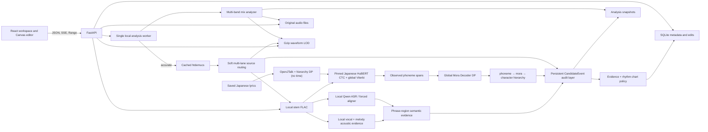

# Architecture

BeatForge Studio is a local-first monorepo. The browser never analyzes audio and never uses
floating-point seconds as persisted timing truth.



## Repository boundaries

- `apps/web` owns the Simplified Chinese React interface, editor state and Canvas rendering.
- `apps/api` owns validation, persistence, background jobs, media Range responses and analysis.
- `packages/shared` documents the canonical TypeScript domain contract.
- `scripts` owns deterministic demo generation, idempotent seeding and offline evaluation.
- `storage/audio` retains uploads; `storage/demo` retains generated WAV and evaluation truth;
  `storage/stems` retains accurate-mode separated FLAC; `storage/waveform` and
  `storage/analyses` are regenerable derived artifacts; `storage/models` holds explicitly
  downloaded Japanese HuBERT weights plus optional historical Qwen/MFA weights and is excluded
  from Git.

## Source-aware analysis boundary

The base analyzer has no PyTorch dependency. `StemSeparator` is an interface with a no-op fallback
and a `DemucsSeparator` implementation. Accurate analysis can run only when the optional
Demucs/PyTorch package and a local `htdemucs` checkpoint are both present. Analysis jobs disable
implicit download; missing dependencies or weights produce a warning and use the balanced mix
pipeline. The task runner keeps model weights under `storage/models/torch`; they are never
repository artifacts.

Successful separation yields time-aligned `vocals`, `drums`, `bass` and `other` sources. The
section analysis summarizes dominance but does not exclusively select one source. Soft routing can
retain simultaneous vocals, melody and drums. `other` is passed through local pYIN pitch-onset
extraction before it can enter the melody lane. This is deliberately narrower than claiming lyric
recognition, piano recognition or full instrument transcription. Stored `focusMap` alternatives,
`CandidateEvent`, `primaryStem` and source evidence expose each decision.

Each source produces real acoustic candidates. A chart policy scores source, acoustic, rhythmic
and semantic evidence; it never creates events from BPM alone. The final chart chooses the
strongest accepted event per grid cell and density neighborhood. Alternatives remain queryable
instead of being deleted. Candidate time is refined on its source and converted once to an integer
index on the original sample-rate timeline.

## Timing invariant

`HitPoint.acousticSample`, `chartSample`, `detectedSample`, `refinedSample`, `snappedSample`,
focus/tempo segment starts and tempo offsets are integer indices in the original audio sample
rate. Legacy `sample` aliases the acoustic coordinate and legacy `snappedSample` aliases the chart
coordinate. `timeSec` is derived from the acoustic sample. Resampling uses an explicit ratio and
rounds only at original/analysis boundaries.

The editor computes a grid item from its absolute integer beat/subdivision index:

```text
sample = round(offset + beatIndex * samplesPerBeat
                      + subdivisionIndex * samplesPerBeat / subdivisionsPerBeat)
```

It never obtains a new position by repeatedly adding the previous floating-point grid step.
All waveform lanes use the same original sample coordinate.

Every mode preserves the refined acoustic attack in `acousticSample`. `chartSample` is the direct
integer grid recommendation and `snapErrorMs` preserves the difference. Strong off-grid acoustic
events may remain accepted. Manual or locked points never enter automatic replacement, and
changing BPM later recomputes chart suggestions without moving acoustic evidence.

## Persistence and failure behavior

SQLite uses foreign keys and WAL mode. Project, track, tempo map, hit points and analysis jobs
survive restart. A process restart marks incomplete jobs as failed with a retryable structured
error; it does not remove source audio. Each completed analysis replaces the unedited derived hit
set transactionally and writes waveform/analysis files atomically. Accurate jobs additionally
write per-stem FLAC files and stem waveform LOD before committing metadata that exposes them.

Manually edited, locked and manual-source hits survive reanalysis, as do manually edited tempo
segments; new detector hits near a preserved user point are suppressed to avoid duplicates.

Lyrics, input format and vocal-alignment JSON live on the track independently of normal analysis
metadata, so re-running onset analysis does not erase corrected text. Vocal jobs have their own
persistent table and real stages. The Qwen runtime is isolated from FastAPI dependencies in a
separate Python environment and invoked with argument arrays rather than a shell. Task output
returns through a temporary JSON file that is removed after parsing.

Singing ASR first localizes saved lyric lines into 20-second chunks; only matched short chunks reach
the speech-oriented forced aligner. Qwen spans are phrase-level semantic regions, not claimed
phoneme attacks. Local onset, envelope, pitch-change and spectral-transition evidence chooses the
actual sample. Every chunk gets an explicit coverage status, and replacement is limited to
successful intervals so local failure cannot erase whole-song vocal fallback points.

The v0.6.1 HuBERT path is the sole user-facing Japanese alignment engine. The Qwen/MFA/Singing/
Hybrid adapters remain readable and callable only as experimental history. `lyric_processor.py` runs OpenJTalk in
the isolated vocal environment and emits an occurrence-stable character/mora/phoneme plan whose
schema rejects every sample or timestamp field. Lexical and observed-phone relationships are found
with dynamic programming. The pinned Japanese HuBERT checkpoint emits phone probabilities from the
real vocals stem; a single global CTC Viterbi path is the only lexical timing source. The dedicated
`mora_decoder.py` then uses one global phoneme edit-distance DP to attach only observed HuBERT phones
to planned mora occurrences and their parent character occurrences. Vocal RMS,
spectral change and pitch change may move a boundary only to a measured feature frame inside its raw
CTC span; otherwise the raw boundary is retained. Mora and character intervals are aggregates of
those observed phones, never divisions of text duration.

Each hierarchy unit stores both `alignedSample` and `refinedSample`. Character units are display-only.
The public `MoraEvent` also exposes playable-mora `text`, `character`, `mora`, `phonemes`,
`startSample`, `endSample` and `confidence`; its start/end are validated aliases of the refined
min/max observed-phone boundary.
Every observed `MoraEvent` produces exactly one base `CandidateEvent` with `source=vocals`,
`generator=hubert_ctc`, `eventLevel=mora`, its mora unit ID/index, parent character indices and
observed phoneme labels. The candidate bundle publishes it alongside the full `MoraEvent`
parent-character and observed-phone-index provenance. A missing mora has no `MoraEvent`, candidate
or fabricated time. Long-vowel splits require a
voiced-vowel HuBERT boundary owned by an explicit `long_vowel` mora, confidence of at least 0.20,
and pitch-change evidence.
Rap policy is triggered by observed mora density. BPM can recommend
`chartSample` for an existing event but cannot create an event. Per-run candidate/report artifacts
live beside the CTC result, while the project comparison is written to
`reports/hubert-alignment-report.json`. HuBERT and Qwen evidence is mapped to the exact same typed
canonical character targets before applying the 0.20 confidence gate; forced-target coverage is
retained as a separate diagnostic and is never presented as evidence-qualified coverage.

All media paths are resolved under the configured storage root. Upload extension, MIME, size and
sanitized file name are validated; decoding is verified before a project is created. Original and
stem audio endpoints implement browser byte ranges.

## Export package boundary

The `.beatforge.zip` package uses schema `2.0`. `manifest.json` defines the authoritative sample
rate, sample count, time origin, tempo map, audio mode and asset checksums. Five independent marker
files live under `markers/` (`mix`, `vocals`, `drums`, `bass`, `other`), while
`analysis/candidates.json` retains non-final acoustic evidence. Every marker stores both
`acousticSample` and the suggested `chartSample`; neither coordinate is silently substituted for
the other.

Audio mode `none` emits data only, `reference` adds a timeline-normalized FLAC, and `full` adds all
available separated stems after sample-rate and frame-count validation. Shareable JSON metadata is
scrubbed of machine-local paths before it enters either the package manifest or the standalone JSON
export.

## Frontend rendering

The main timeline is a bounded, device-pixel-ratio-aware Canvas. Only the current sample viewport
is painted. The API chooses a waveform min/max level whose point count is suitable for the
viewport; grid lines and hit points are batched into the same render pass rather than created as
individual React components. The minimap stays at whole-track scale.

For accurate projects the same Canvas stacks Mix/人声/鼓/贝斯/other waveform lanes. Lane geometry
and sample-to-X conversion are shared, so adding or hiding a lane cannot shift a point. A focus
strip shows section evidence. The Candidate Layer filters vocals/melody/drums and paints accepted,
uncertain and rejected alternatives; circles mark acoustic positions and triangles mark chart
positions. The playback element can switch sources while retaining the integer sample position.

Alignment Lab is fixed to Japanese HuBERT CTC and has no method selector, comparison lanes or method
ranking. It opens on the Mora lane and switches without inference among Character, Mora and Phoneme
lanes, drawing raw CTC spans/anchors separately from refined spans/anchors. The lyrics panel expands
explicit hierarchy relations as Character → Mora → Phoneme; it never reconstructs children from
text length. The hover inspector reports both sample intervals, RMS/spectral/pitch evidence and the
DP match operation.

Zustand owns sample-accurate editor state and undo/redo snapshots. TanStack Query owns server
state. Debounced saves send complete hit-point state and surface saving, saved and failed states;
a failed write remains retryable.

## Extension points

- `tempoMap` is an array although the first UI edits one constant-tempo segment.
- `StemSeparator` isolates optional source separation from the base CPU pipeline.
- `focusMap` segments have IDs and sample boundaries, leaving room for future manual focus
  overrides without changing hit timing identity.
- Hit-point `source`, `primaryStem`, `stemEvidence`, `detectorVotes`, locking and edit provenance
  support later chart lanes, lyrics/phoneme evidence, difficulty generation and long-note
  derivation without changing timing identity.
- HuBERT hierarchy units, typed `MoraEvent` records and generated vocal candidates separately retain
  aligned, refined and chart samples, leaving room for vowel-nucleus or melody-note layers without
  rewriting timing fields.
